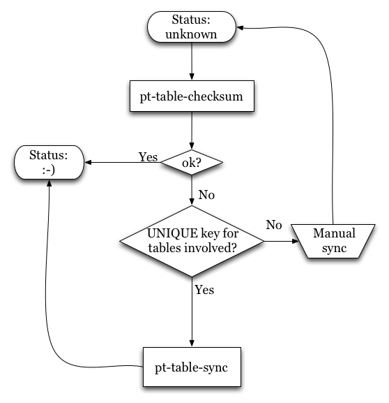
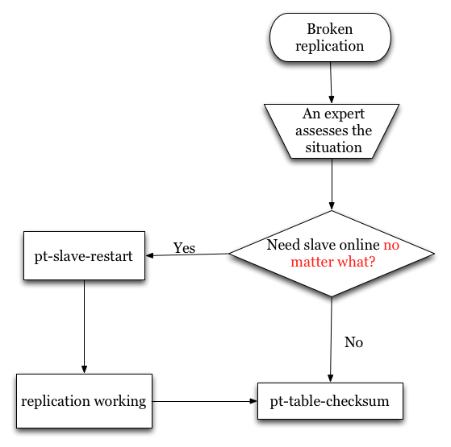
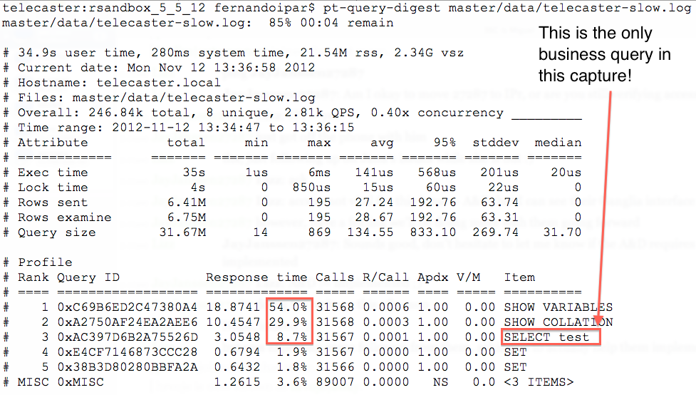

10 Percona Toolkit tools every MySQL DBA should know about
===

Fernando Ipar - Percona Webinars 2012

!

About me
===

- Fernando Ipar
- Consultant @ Percona
- fernando.ipar@percona.com

!

About this presentation
===

- Introductory level
- Real world examples
- http://github.com/fipar/10&#95;pt&#95;tools
- http://github.com/fipar/percona&#95;toolkit&#95;recipes

!

About Percona Toolkit
===

- Actual customer problems
- Extensive test coverage
- Works with every version since 5.0
  - Some tools with 4.1 too
- Good community
- Covered by our Support services

!

Before we begin
===

Knowing your DSNs

!

(This includes all of today's tools except pt-stalk and pt-sift)

!

Data Source Names in a nutshell
===

- comma separated K/V list
- h=localhost,u=root,p=s3cr3t
- For multiple hosts, specific DSN inherit from others
  - So your life will be easier if you keep your credentials
    consistent across hosts
- Full story: http://bit.ly/percona-toolkit-dsn-spec

!

Before running a tool
===

- Read the manual carefully
- Test
- Have a tested backup available

!

Replication management tools
===

!

pt-table-checksum
===

Determines if a master and its replicas have a consistent copy of
  the dataset
  
!

Why would a replica *not* be consistent?
===

- Writing directly to it
- Using SBR
- Bad coordinates after server crash
- &lt;your reason here&gt;

!

How does it work?
===

- Uses STATEMENT based replication
  - Does not change other sessions
- Runs checksum queries against master
  - Waits for them to replicate to slaves
  - Checks for differences in the results

!

The scenario
===

Master A, replicas B and C

!

    pt-table-checksum --replicate percona.checksums h=A

!

Yes, it's *that* simple! 

Some considerations: 

- Schema differences may break replication
- Will self-throttle checking replica lag
  - But don't leave unattended

!

pt-table-sync
===

If pt-table-checksum gives you the bad news, pt-table-sync helps you
go back to a sane state. 

!

The scenario
===

Master A, replicas B and C. 

    pt-table-checksum found differences on C. 

!

    pt-table-sync --replicate percona.checksums --print h=A

happy with what you see? then add --execute

!

!

pt-slave-delay
===

- Intentionally keep a slave behind

!

 

(http://xkcd.com/327/ is one reason why a slave is **not** a backup)

!

    pt-slave-delay --delay 2h h=slave

!

pt-slave-restart
===

- Automatically skip replication errors
- Only as a last resort!

!

    pt-slave-restart h=slave

!

!
pt-heartbeat
===

- Reliably measure replication lag
- Works with Percona Monitoring Plugins
  - http://www.percona.com/software/percona-monitoring-plugins

!

On master
===

    pt-heartbeat -D percona --create-table --update h=master

!

From nagios/etc
===

    pt-heartbeat -D percona --check h=replica

!

Performance optimization tools
===

!

pt-query-digest
===

- Analyze MySQL queries
- Discover optimization opportunities
- Prevent scalability bottlenecks

!

    pt-query-digest <path-to-log>

!

!

Operations tools
===

!

pt-upgrade
===

- Compare query results & run time against different instances
- Part of proper version upgrade testing

!

pt-online-schema-change
===

- Minimize impact of ALTERing tables

!

Root cause analysis tools
===

!

pt-stalk
===

- Helps diagnose hard-to-catch problems
- 'Random' stalls

!

    pt-stalk --threshold 

!

pt-sift
===

- High level overview of pt-stalk data

!

Q/A
===
